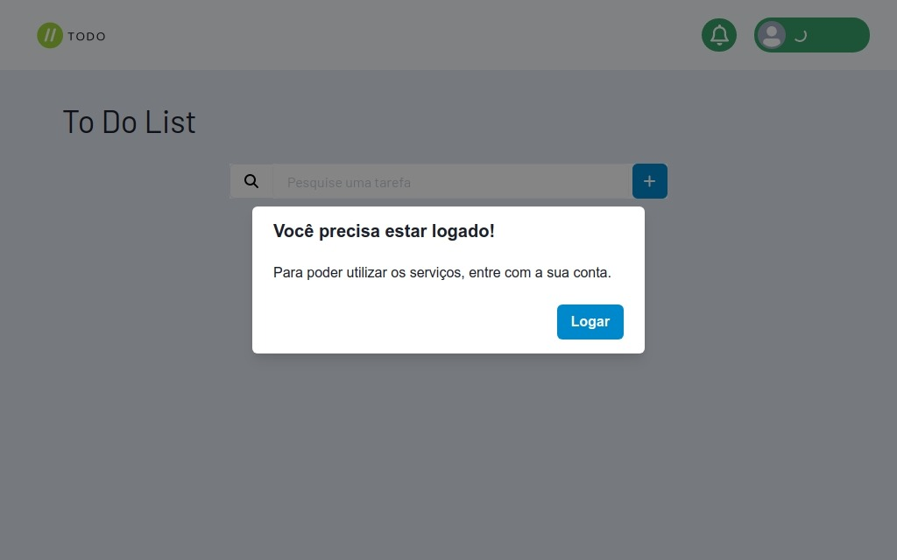
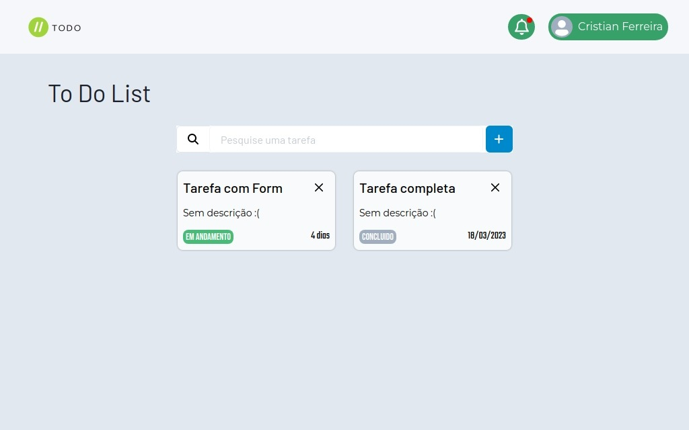
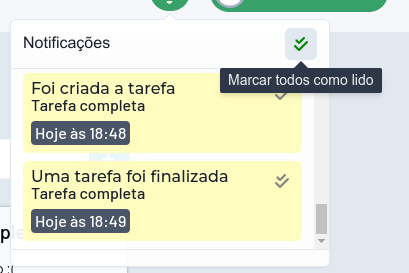
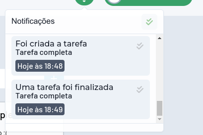
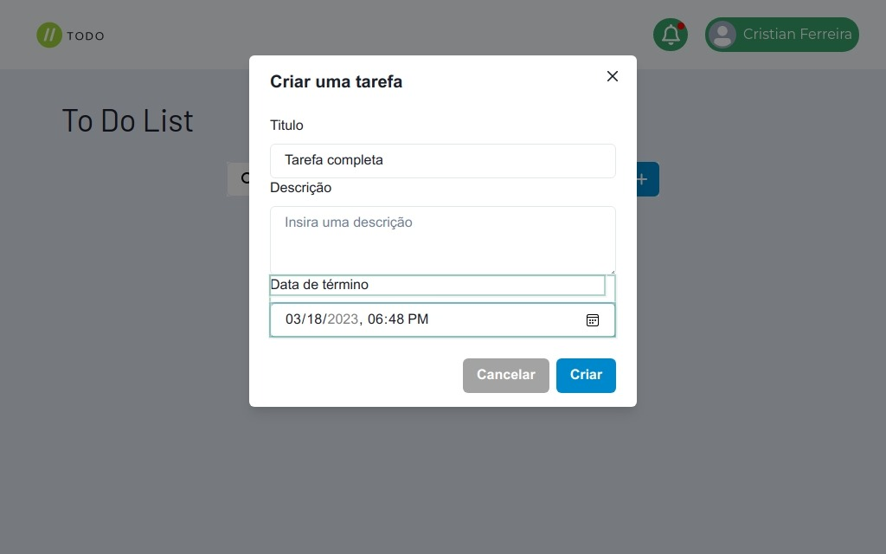

  

    
    <h1 align="center">Todo-app</h1>
  

	<h2>Tarefas com notificações</h2>
	
Um app de tarefas utilizando a arquitetura de microserviços com o ecossistema Spring Cloud, RabbitMQ, Keycloak e React.

---

## Projeto

Este é um projeto prático utilizando a arquitetura de microserviços com o ecossistema Spring Cloud. 

Usei algumas das ferramentas mais utilizadas para esta arquitetura como o Spring Cloud Netflix Eureka, RabbitMQ, Spring Cloud Gateway e Spring Cloud Loadbalancer.

Foram criados 4 microsserviços, os quais são:
| Serviço | Descrição |
| -- | -- |
| [`tasks-api`](https://github.com/Cristian-SknZ/todo-app/tree/master/tasks-api) | Uma simples API Rest para o gerenciamento de tarefas.|
| [`tasks-notifications`](https://github.com/Cristian-SknZ/todo-app/tree/master/tasks-notifications) | Um serviço que gerencia, agenda notificações de tarefas e envia notificações por email. Possui uma API Rest para consulta de notificações. |
| [`tasks-discovery`](https://github.com/Cristian-SknZ/todo-app/tree/master/tasks-discovery) | Serviço de descoberta que utiliza o Spring Cloud Netflix Eureka Server. |
| [`tasks-gateway-server`](https://github.com/Cristian-SknZ/todo-app/tree/master/tasks-gateway-server) | Serviço de roteamento e balanceamento de carga utilizando o Spring Cloud Gateway e Spring Cloud Loadbalancer. |

Também foram utilizados outros serviços como:
* `RabbitMQ` RabbitMQ utilizado para a comunicação AMQP entre os microsserviços.
* `Keycloak` Keycloak utilizado para a autorização e autenticação de usuários com os protocolos OAuth2 e OpenId Connect.
* `PostgreSQL` Banco de dados utilizado nos microsserviços.

Todo este ambiente foi projetado para ser executado em containers Docker, e estão configurados para ambiente de desenvolvimento. 

O correto em uma arquitetura de microsserviços é o uso de banco de dados separados para cada serviço para evitar o acoplamento entre os serviços, porem não conseguiria executar o ambiente completo na minha maquina, por isso decidir não fazer isso.

### Rotas das aplicações
Como expliquei anteriormente, existem duas APIs REST, uma para o serviço de tarefas e outra para o serviço de notificações.

As rotas do serviço `tasks-api` são:
| Método | Rota | Descrição |
| --- | --- | --- |
| GET | /tasks | Retorna todas as tarefas cadastradas |
| GET | /tasks/{id} | Retorna a tarefa com o id especificado |
| POST | /tasks | Cria uma nova tarefa |
| PUT | /tasks/{id} | Atualiza a tarefa com o id especificado |
| DELETE | /tasks/{id} | Remove a tarefa com o id especificado |

Enquanto as rotas do serviço `tasks-notifications` são:

| Método | Rota | Descrição |
| --- | --- | --- |
| GET | /notifications/all | Retorna todas as notificações |
| GET, DELETE | /notifications/{id} | Retorna ou deleta a notificação com o id especificado |
| GET | /notifications/unreads | Retorna todas as notificações não lidas |
| PUT | /notifications/unreads | Marca todas as notificações como lidas |
| GET | /notifications/unreads/{id} | Retorna a notificação não lida com o id especificado |
| PUT | /notifications/unreads/{id} | Marca a notificação com o id especificado como lida |

---

### Front End

Criei uma UI simples com todos os recursos disponíveis nos microsserviços, decidi estilizar a aplicação com o ChakraUI que tem a abordagem css in js com alguns componentes prontos como Modais e Popovers.

Para poder utilizar os serviços da aplicação é necessarios estar autenticado, ao pressionar em "Logar" o usuário sera redirecionado ao servidor de autenticação do Keycloak.

Após efetuar o login, a aplicação irá mostrar todas as tarefas existentes, e também mostrará as notificações.

| | |
| -- | -- |
|  |  |

As estão disponíveis na aplicação e podem ser lidas a qualquer momento. Após o termino de uma tarefa, uma notificação por email é enviada.

Na criação de uma tarefa é possivel atribuir um titulo, descrição e quando a tarefa irá terminar.

--- 

## Inciar o ambiente

Para você poder executar o ambiente inteiro, você precisará de alguns requisitos:
* Java 17+
* Gradle 7.6.1 ou mais recente.
* NodeJS 16+
* Docker

Após atender os requisitos, você precisará fazer o build de todos os serviços, para facilitar o processo
criei um script para fazer isso, só executar o comando `sh ./build.sh` na raiz do projeto.

Com o build realizado, só resta executar o projeto com o script `sh ./run.sh`. Espere todos os serviços subirem
e depois você poderá acessar a UI da aplicação pelo IP `http://localhost:5173/`.

Os serviços estão todos configurados corretamente, sem necessidade de configurações adicionais.

---

## Conclusão

Este projeto apesar de parecer simples, contém coisas mais complexas em sua arquitetura, como o entedimento de como os microsserviços funcionam, sua comunicação asssincrona, autenticação com Single-SignOn e outros conhecimentos de bibliotecas da familia Spring Cloud.

O desenvolvimento desse projeto se deu por conta do meu aprendizado com microsserviços, não era um projeto que eu pretendia deixar publico. Afim de mostrar a minha pratica e conhecimento sobre o tema no meu portfolio, decidi deixar este projeto público.